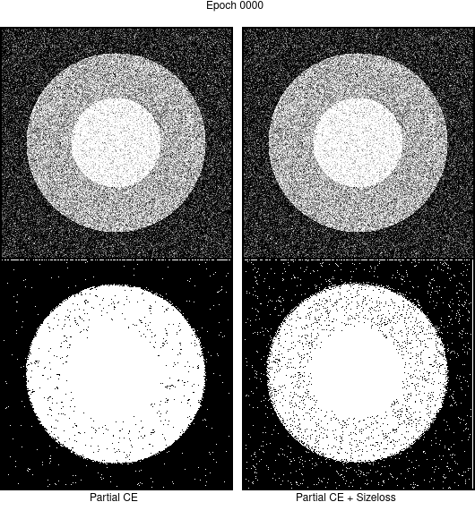

# Code demo for the weakly supervised segmentation tutorial at MICCAI2019



Requirements:
```
pytorch
torchvision
numpy
scipy
matplotlib
tqdm
```

Run:
```bash
python3 -O 7-WeaklySup_Segmentation.py --mode 0
python3 -O 7-WeaklySup_Segmentation.py --mode 1
python3 plotResults.py
./gifs.sh
```
