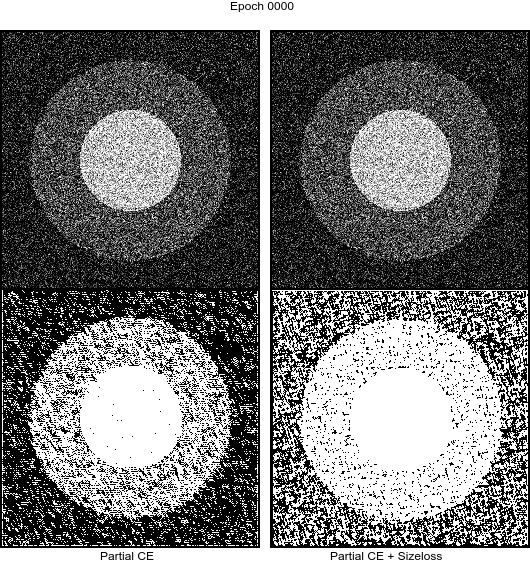

# MICCAI 2020 Tutorial
## Weakly Supervised CNN Segmentation: Models and Optimization

This repository contains the code of the hand-on tutorial, that runs on two datasets:
* A very simple toy example
* [PROMISE12](https://promise12.grand-challenge.org) prostate segmentation challenge

Also founds, the slides and recordings of the tutorial.

### Slides
Slides from the three sessions are available in the [`slides/`](slides/) folder.


### Recordings
* [Session 1](https://drive.google.com/file/d/1NVn2J4y6l7_Yxw6RGBD2CEIEedliccjQ/view?usp=sharing): Structure-driven priors: _Regularization_
* [Session 2](https://drive.google.com/file/d/1wAVxBk4U45-SZhDWviCgFShytf0wrJze/view?usp=sharing): Knowledge-driven priors (e.g., anatomy): _Constraints_
* [Session 3](https://drive.google.com/file/d/1EohLWWa5vMmEMxw3Rqk4eYaDzbr_Clp2/view?usp=sharing): Data-driven priors: _Adversarial learning_
* [Session 4](https://drive.google.com/file/d/1NMU7z0KhXYX6idgCBehdaNVAifOE6Ey3/view?usp=sharing): Hands-on: _Size constraints_


### Hands-on


The goal here is to enforce some inequality constraints on the size of the predicted segmentation in the form:
```
lower bound <= predicted size <= upper bound
```
where `predicted size` is the sum of all predicted probabilities (softmax) over the whole image.

To make the example simpler, we will define the lower and upper bounds to 0.9 and 1.1 times the ground truth size. All the code is contained within the `code` folder

#### Requirements
The code has those following dependencies:
```
python3.7+
pytorch (latest)
torchvision
numpy
tqdm
```
Running the PROMISE12 example requires some additional packages:
```
simpleitk
scikit-image
PIL
```

#### Data
The data for the toy example is stored in `code/data/TOY`. If you wish, you can regenerate the dataset with:
```
make -B data/TOY
```
or you can use [gen_toy.py](code/gen_toy.py) directly.

Participants willing to try the PROMISE12 setting need to download the data themselves, then put the .zip inside the `code/data` folder (a list of files is available in `code/data/promise12.lineage`). Once the three files are there, the slicing into 2D png files is automated:
```
make data/PROMISE12
```
It will:
* checks data integrity
* extract the zip
* slice into 2d slices
* generate weak labels from the actual ground truth

#### Training
```
>>> ./main.py -h
usage: main.py [-h] [--epochs EPOCHS] [--dataset {TOY,PROMISE12}] [--mode {constrained,unconstrained,full}] [--gpu]

optional arguments:
  -h, --help            show this help message and exit
  --epochs EPOCHS
  --dataset {TOY,PROMISE12}
  --mode {constrained,unconstrained,full}
  --gpu
```
The toy example is designed to run under 5 minutes on a laptop, training on CPU. The following commands are equivalent
```
python3 main.py
./main.py
./main.py --epochs 200 --dataset TOY --mode unconstrained
```

The three modes correspond to:
* unconstrained: use the weak labels, with only a partial cross-entropy (won't learn anything)
* constrained: use the weak labels, with partial cross-entropy + size constraint (will learn)
* full: use full labels, with cross entropy (will learn, for obvious reasons)

The settings for PROMISE12 are too simple to get state of the art results, even in the `full` mode, but it gives a good starting point for new practitioners to then build on.
